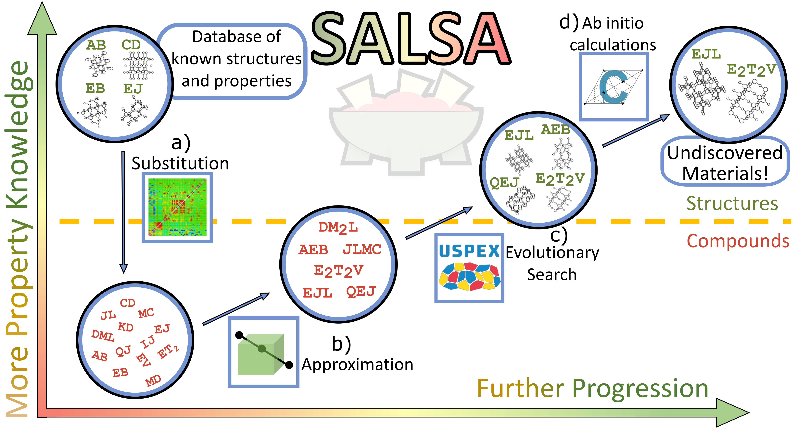

# SALSA

```
                                                                                
                                      ..                    .                   
                                      ))).                  )).                 
                   ..                 )))))))))).           )))))).             
             .(((((((                 )))))))))))))))      )))))))))))).        
        (((((((((((((                 )))))))))))))       ))))))))))))))))      
       (((((((((((((((            .@@@@@@@@@@)))))       )))))))))))))))        
         (((((((((((((@@@@@   @@@@@@@@@@@@@@@@@@@@ @@@@@)))))))))))))           
           ((((((((((((@@@@@@@@@@@@@@@@@@@@@@@@@@@@@@@@@@@@@@@)))))             
           .@(((@@@@@@@@@@@@@@@@@@@@@@@@@@@@@@@@@@@@@@@@@@@@@@@@))@@@@@@@@      
 ..@@@@@@@@@@@@@@@@@@@@@@@@@@@@@@@@@@@@@@@@@@@@@@@@@@@@@@@@@@@@@@@@@@@@@@@@@@@..
 (SALSASALSASALSASALSASALSASALSASALSASALSASALSASALSASALSASALSASALSASALSASALSASA)
  SALSASALSASALSASALSASALSASALSASALSASALSASALSASALSASALSASALSASALSASALSASALSASA 
   SALSASALSASALSASALSASALSASALSASALSASALSASALSASALSASALSASALSASALSASALSASALSA  
    SALSASALSASALSASALSASALSASALSASALSASALSASALSASALSASALSASALSASALSASALSASAL   
      SALSASALSASALSASALSASALSASALSASALSASALSASALSASALSASALSASALSASALSASALS     
         SALSASALSASALSASALSASALSASALSASALSASALSASALSASALSASALSASALSASAL        
          ' SALSASALSASALSASALSASALSASALSASALSASALSASALSASALSASALSASA '         
         SALS'''SALSASALSASALSASALSASALSASALSASALSASALSASALSASALS'''SALS        
         SALSASAL'''' SALSASALSA'SALSASALSASALSASALSASALSAS ''''SALSASAL        
        SALSASALSASAL            SALSASALSASALSA            SALSASALSASAL       
                                 SALSASALSASALSA                                
                                 SALSASALSASALSA                                
                                                                                
                                                                                
::::::::::::::::::::::::::::::::::::::::::::::::::::::::::::::::::::::::::::::::
::::::::::::::::::::::::::::::::::::::::::::::::::::::::::::::::::::::::::::::::
                                                                                
                                                                                
    SSSSSSS            AA          LLLL           SSSSSSS            AA         
 SSSSSSSSSSSS         AAAA         LLLL        SSSSSSSSSSSS         AAAA        
SSSS                 AAAAAA        LLLL       SSSS                 AAAAAA       
SSSSS               AAA  AAA       LLLL       SSSSS               AAA  AAA      
 SSSSSSSSS         AAA    AAA      LLLL        SSSSSSSSS         AAA    AAA     
    SSSSSSSSS     AAA      AAA     LLLL           SSSSSSSSS     AAA      AAA    
         SSSSS   AAAAAAAAAAAAAA    LLLL                SSSSS   AAAAAAAAAAAAAA   
          SSSS  AAAAAAAAAAAAAAAA   LLLL                 SSSS  AAAAAAAAAAAAAAAA  
 SSSSSSSSSSSS  AAAA          AAAA  LLLLLLLLLLL SSSSSSSSSSSS  AAAA          AAAA 
  SSSSSSSSS   AAAA            AAAA LLLLLLLLLLL  SSSSSSSSS   AAAA            AAAA
                                                                                
                                                                                
::::::::::::::::::::::::::::::::::::::::::::::::::::::::::::::::::::::::::::::::
::::::::::::::::::::::::::::::::::::::::::::::::::::::::::::::::::::::::::::::::
                                                                                                                                                               
```

**SALSA** (**S**ubstitution, **A**pproximation, evo**L**utionary **S**earch, and **A**b-initio) is a high-throughput computational materials discovery pipeline for identifying materials with target properties.

The workflow begins with an initial dataset of compounds with known structures and properties. Using a substitution likelihood matrix trained on the Inorganic Crystal Structure Database (ICSD), SALSA generates candidate compositions by swapping ionic components between known compounds. Properties of these candidates are approximated via linear interpolation, filtering down to those within a user-defined target region of property space. Surviving candidates undergo evolutionary crystal structure prediction (USPEX) to find stable structures, followed by high-fidelity DFT calculations (CRYSTAL) to refine property estimates. The result is a set of novel, thermodynamically stable materials predicted to meet the target criteria.



## Overview

SALSA automates the discovery of novel semiconductor materials through a four-stage workflow:

1. **Substitution** - Generate candidate compounds via ionic substitution from known ICSD database materials
2. **Approximation** - Filter candidates using property interpolation to target bandgap and redox potential ranges
3. **evoLutionary Search** - Predict stable crystal structures using USPEX evolutionary algorithm
4. **Ab-initio calculations** - Calculate electronic properties with CRYSTAL DFT (HSE06 hybrid functional)

## Quick Start

```bash
# Clone and setup
git clone https://github.com/SeanStafford/SALSA.git
cd SALSA

# Create virtual environment
make venv
source .venv/bin/activate

# Install dependencies
make install-dev

# Configure environment
cp .env.example .env
# Edit .env to set PROJECT_ROOT (all other paths derive from it)
```


## Project Organization

```
SALSA/
├── salsa/                       
│   ├── core/                    # Workflow orchestration
│   │   ├── propagate.py         
│   │   └── inventory.py         
│   ├── crystal/                 # CRYSTAL DFT interface
│   │   ├── instantiate_d12.py   
│   │   └── extract_bandgap.py   
│   ├── uspex/                   # USPEX interface
│   │   └── structure.py         
│   └── utils/                   # Shared utilities
│       └── logging.py           
├── scripts/                     # HPC shell scripts
│   ├── USPEX_status_check       # Monitor USPEX jobs
│   ├── CRYSTAL_status_check.sh  # Monitor CRYSTAL jobs
│   └── setup_project.sh         # Initialize new projects
├── reference/                   # Reference data
│   ├── basis_sets/              
│   ├── potcars/                 
│   └── templates/               
├── projects/                    
├── pyproject.toml              
├── Makefile                    
└── .env.example                
```

## Technical Highlights

- **State Machine Orchestration** - `InventoryRow` class manages compound progression through USPEX → CRYSTAL workflow with automatic job submission and failure recovery
- **SLURM Integration** - Seamless HPC job management with status monitoring and resubmission
- **CSV Persistence** - Robust inventory tracking with atomic updates for crash recovery
- **Multi-step DFT Workflows** - Sequential CRYSTAL calculations with geometry optimization steps

## External Dependencies

- [USPEX](https://uspex-team.org/) - Crystal structure prediction
- [CRYSTAL](https://www.crystal.unito.it/) - Quantum chemistry (DFT)
- [VASP](https://www.vasp.at/) - DFT for USPEX (requires license + POTCARs)
- SLURM - Workload manager


## Citation

If you use SALSA in your research, please cite:

> Stafford, S.M., Aduenko, A., Djokic, M., Lin, Y.-H., & Mendoza-Cortes, J.L.
> "Transforming Materials Discovery for Artificial Photosynthesis: High-Throughput
> Screening of Earth-Abundant Semiconductors."
> *Journal of Applied Physics* **134**, 235706 (2023). [DOI: 10.1063/5.0178907](https://doi.org/10.1063/5.0178907)

## Authors

- Dr. Sean M. Stafford
- Dr. Alexander Aduenko
- Marcus Djokic
- Dr. Yu-Hsiu Lin
- Dr. Jose L. Mendoza-Cortes

## Acknowledgments

This work was supported by Michigan State University start-up funds and computational resources from the Institute for Cyber-Enabled Research at Michigan State University.

